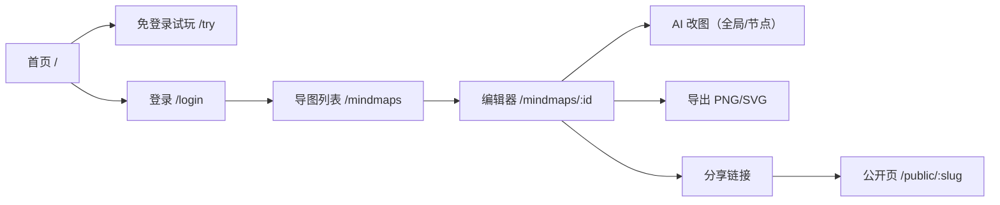

# MMA P0/P1 执行清单（产品功能 + 交互细节 + 线框 + 文案 + 验收 + Spec + Backlog）

版本：v0.1.x（体验与转化提升）  
状态：Draft  
最后更新：2026-02-07  
关联文档：`docs/prd.md`（MVP 范围与技术基线）

---

## 0. 目标、原则与成功标准

### 0.1 目标（P0）

- 让首次访问用户在 **30–60 秒**内理解并感受到差异化：**“对话生成/修改导图 + 可控（ops）+ 可撤销”**
- 降低激活成本：无需登录即可体验“编辑器手感”（并提供清晰的“登录后可用 AI/云端保存”路径）
- 把核心工作流做顺：**新建 → 编辑 → AI 改图 → 手工微调 → 导出/分享**

### 0.2 目标（P1）

- 让 AI 改图从“能用”变成“可信、可控、可复盘”
- 强化效率：键盘流、结构化引导、上下文控制、操作日志

### 0.3 产品原则（写进每个 PR 的自检）

1. **可控优先于聪明**：AI 只能通过 ops 改图；危险改动必须可见、可撤销、可确认
2. **先让用户动起来**：首屏只做一件事——把用户推进到“可以编辑的画布”
3. **信息密度与认知负担平衡**：默认简单；高级能力渐进披露（advanced disclosure）
4. **一致的语言与语气**：全站默认中文（zh-CN）；英文仅作为后续 i18n

### 0.4 可验收成功标准（建议的 North Star）

- 7 日内完成一次“AI 改图 + 手工微调 + 导出或分享”的用户占比（MVP 后监控）
- P0 验收：不看说明，用户能从首页完成“进入可编辑画布 → 产生导图输出（导出/分享/保存）”

---

## 1. 核心用户旅程与信息架构（更新版）

### 1.1 核心旅程（P0）



### 1.2 页面与导航（建议）

- `/`：产品首页（Hero + 价值主张 + CTA）
- `/try`：免登录试玩（本地草稿 / sample）
- `/login`、`/signup`
- `/mindmaps`：我的导图（列表）
- `/mindmaps/:id`：编辑器（画布 + 工具栏 + AI 侧栏）
- `/public/:slug`：公开只读页（画布 + notes 阅读）

### 1.3 首屏 CTA 的信息层级（P0 约束）

优先级从高到低：

1. `立即体验（免登录）`
2. `登录继续（已有账号）`
3. `注册并保存到云端`

---

## 2. P0（必须做）：转化与“手感”优先

> 下面每个条目包含：功能/交互 → 线框 → 文案 → 验收标准。

### P0-1 首页产品化（从 scaffold 变成 landing）

#### 功能与交互细节

- 顶部导航（最小化）：
  - 左：Logo（MindMaps AI）
  - 右：`立即体验`（主按钮）、`登录`（文字按钮）、`注册`（次按钮）
- Hero（必须一眼看懂差异化）：
  - 标题：对话生成“可控”的思维导图
  - 关键卖点三连（短句 + 图标占位）：
    - 对话改图：用自然语言扩展/重组结构
    - 可控 ops：每次改动可审计、可校验
    - 可撤销：AI 与手工操作共享撤销栈
- 第二屏：30 秒快速上手（3 步）
  1. 进入试玩 2) 发送一句话 3) 导出/分享
- 可信背书（轻量）：隐私声明一句话 + “不用于训练（MVP 文案）”

#### 页面线框（低保真）

```text
+----------------------------------------------------------------------------------+
| MindMaps AI                                    [立即体验]  登录  [注册]         |
+----------------------------------------------------------------------------------+
| 对话生成“可控”的思维导图                                                         |
| 用自然语言扩展结构，所有改动都能校验、可撤销。                                    |
| [立即体验（免登录）]   [查看示例]                                                 |
| * 无需安装  * 支持导出 PNG/SVG  * 可生成公开分享链接（登录后）                    |
+----------------------------------------------------------------------------------+
| 30 秒上手：                                                                       |
| 1. 打开试玩 → 2. 输入一句话 → 3. 导出或注册保存                                   |
+----------------------------------------------------------------------------------+
| FAQ（可折叠）：AI 如何修改？数据是否安全？                                        |
+----------------------------------------------------------------------------------+
| Footer：隐私/安全/联系                                                           |
+----------------------------------------------------------------------------------+
```

#### 文案（可直接落地）

- Hero 标题：`对话生成“可控”的思维导图`
- Hero 副标题：`用自然语言扩展结构；每次 AI 改动都会以 ops 形式应用，并支持撤销/重做。`
- 主 CTA：`立即体验（免登录）`
- 次 CTA：`登录继续`
- 卖点：
  - `对话改图：一句话扩展结构`
  - `可控 ops：结构化、可校验`
  - `可撤销：AI/手工统一历史栈`
- 隐私短句：`默认不将你的导图与对话用于训练（后续将提供完整隐私政策页面）。`

#### 验收标准

- [ ] 首页首屏存在明确主 CTA：`立即体验（免登录）`，点击进入 `/try`
- [ ] 首屏 10 秒内可回答：这是什么、能做什么、与普通导图工具差异在哪
- [ ] 全站默认中文一致（除非明确标注后续 i18n）

---

### P0-2 免登录试玩（/try）：把用户推进到可编辑画布

#### 功能与交互细节

- 访问 `/try` 不需要登录，进入一个“本地草稿导图”
- 试玩模式能力边界（P0）：
  - ✅ 画布编辑：新增/删除/重命名/缩进/拖拽重排/折叠/撤销重做/导出
  - ✅ 节点 notes 编辑（可选）
  - ✅ 本地保存：自动保存到 `localStorage`（刷新不丢）
  - ❌ 云端保存（提示登录/注册）
  - ❌ 公开分享（提示登录/注册）
  - ❌ AI 改图：可选两种策略（择一落地）
    - **策略 A（更简单）**：试玩不提供 AI，只提供“示例提示词”和“登录后可用 AI”的明确提示
    - **策略 B（更震撼）**：提供“游客 AI”（需要新增 guest API + 频控/限额），见 P1-2 依赖

> 建议 P0 先落地策略 A，确保转化与工程复杂度可控；P1 再做游客 AI。

- 顶部提示条（清晰但不打扰）：
  - `你正在试玩本地草稿。登录后可使用 AI 与云端保存。 [登录] [注册]`
- 退出提示：
  - 用户从 `/try` 跳转到登录/注册时，提示“草稿不会丢失，可在登录后导入”（P1 可实现导入）

#### 页面线框（低保真）

```text
+----------------------------------------------------------------------------------+
| 试玩模式：本地草稿（刷新不丢）   登录后可用 AI/云端保存      [登录] [注册]        |
+----------------------------------------------------------------------------------+
| 工具栏：撤销 重做  新增子节点 新增同级 缩进 取消缩进 折叠/展开  导出PNG 导出SVG    |
+----------------------------------------------------------------------------------+
| 画布（可编辑）                                                                  |
|                                                                                  |
+----------------------------------------------------------------------------------+
|（可选）右侧：提示词示例 / 功能介绍（非 AI）                                      |
+----------------------------------------------------------------------------------+
```

#### 文案（可直接落地）

- 顶部条：`你正在试玩本地草稿。登录后可使用 AI 与云端保存。`
- 按钮：`登录`、`注册`
- 右侧示例（如做）：`试试这些：为“产品发布计划”生成导图骨架；把“风险”节点展开 5 个分支…`

#### 验收标准

- [ ] 未登录用户可直接访问 `/try` 并编辑导图
- [ ] 刷新页面后导图仍在（localStorage）
- [ ] 明确且一致地引导登录/注册，并说明登录能获得什么

---

### P0-3 编辑器就地编辑 + 键盘效率（把导图做成“肌肉记忆”）

#### 功能与交互细节

- 节点标题编辑（至少一种就地交互）：
  - 双击节点 → 进入就地编辑（输入框覆盖节点）
  - 或按 `F2` → 编辑当前选中节点
- 快捷键（P0 目标：覆盖 80% 高频动作）
  - `Enter`：新增子节点并进入编辑
  - `Tab`：新增同级节点并进入编辑（或 `Shift+Enter` 作为同级，二选一但需一致）
  - `Backspace/Delete`：删除节点（非 root，且可撤销）
  - `Cmd/Ctrl+Z`、`Cmd/Ctrl+Shift+Z`：撤销/重做
  - `Space`：折叠/展开（可选）
- “Details 弹窗”定位调整：
  - P0：弹窗仍保留，但变成“编辑 notes/高级信息”
  - 标题编辑优先走就地编辑，弹窗不再是主入口

#### 交互规格（更细：状态机 + 冲突处理）

**标题编辑状态（Title Editing）**

- 进入：双击节点 / `F2` / 新增节点后自动进入
- 提交：
  - `Enter`：保存标题（trim 后非空）
  - 点击画布空白：保存标题（可选；若实现需与“取消”区分）
- 取消：
  - `Esc`：放弃本次修改（恢复进入编辑前的标题）
- 约束：
  - Root 节点允许改名（改变 mindmap title 的联动为 P1 议题；P0 可仅改节点文本）
  - 标题为空时：禁止提交并提示 `标题不能为空`

**快捷键触发范围**

- 当焦点在 `input/textarea/select/button/a` 或 `contentEditable` 内时：不响应画布快捷键（与当前实现保持一致）
- 当处于 Title Editing 时：只响应 `Enter/Esc`（避免误触新增/撤销/删除等）

**与现状冲突处理（必须明确）**

- 现状：编辑器页面按下 `Enter` 会打开 `Details` 弹窗（参见 `src/app/mindmaps/[mindmapId]/MindmapEditor.tsx` 的键盘处理）
- P0 调整：`Enter` 优先用于“新增子节点并进入标题编辑”；`Details` 改为：
  - 工具栏按钮 `详情` 触发（已存在）
  - 或新增快捷键 `E`（可选）

#### 编辑器整体线框（低保真，作为 P0 信息层级参考）

```text
+----------------------------------------------------------------------------------+
| MindMaps AI    状态：已保存/保存中…    选中：学习计划                             |
| [撤销][重做] [新增子][新增同级] [缩进][取消缩进] [折叠/展开] [导出] [分享] […]     |
+----------------------------------------------------------------------------------+
| 主区：画布（可编辑、拖拽、缩放）                       | 右侧：Chat（登录后）      |
| - 顶部右侧小提示：拖拽重排 / 拖到节点上=换父           | [Global][Node]            |
|                                                       | 目标节点：…（node 时）    |
|                                                       | 对话流 + 变更摘要          |
|                                                       | 输入框 + 示例 chips（P1） |
+----------------------------------------------------------------------------------+
|（可选）底部：快捷键提示（首次出现、可关闭）                                    |
+----------------------------------------------------------------------------------+
```

#### 页面线框（节点就地编辑状态示意）

```text
[节点：学习]  （双击/按F2）
----------------------+
| [ 学习计划       ]  |  ← 输入框，Enter 保存
----------------------+
Esc 取消 / Enter 保存 / Shift+Enter 换行（如支持）
```

#### 文案（可直接落地）

- Tooltip（节点）：`双击编辑 · F2 编辑 · Enter 添加子节点 · Tab 添加同级`
- 删除确认（仅在必要时）：`删除该节点及其子树？（可撤销）`

#### 验收标准

- [ ] 用户无需打开弹窗即可完成“选中节点 → 改标题 → 连续新增 3 个子节点”
- [ ] 快捷键与按钮行为一致、可撤销
- [ ] root 节点不可删除/移动（与现有约束一致）

---

### P0-4 AI 改图的“可控感”：高亮 + 摘要 + 安全模式

#### 功能与交互细节

AI 请求完成并应用 ops 后，用户需要立刻“看懂发生了什么”：

- 变更高亮（必做）：
  - 对新增/重命名/移动的节点加短暂高亮（3–5s）
  - 若发生删除：提示“删除了 X 个节点（可撤销）”，并在撤销后恢复
- 变更摘要（必做）：
  - 在聊天消息下方或顶部 toast 显示：`新增 3 · 改名 1 · 移动 0 · 删除 0`
- 安全模式（P0 先落地简单版本）：
  - 默认：AI 不允许 `delete_node`（或遇到 delete 要求二次确认再发送）
  - 节点模式：严格 scope，越界直接失败并提示“超出选中子树范围”

#### 变更摘要与高亮规则（Spec）

**变更计数（用于摘要）**

- `add_node` → `新增 +1`
- `rename_node` → `改名 +1`
- `move_node` → `移动 +1`（同父 reorder 可算作移动或忽略，但必须在全站一致）
- `delete_node` → `删除 +1`（建议同时显示“影响节点总数”，见下）
- `reorder_children`：
  - 方案 A：计入 `移动`
  - 方案 B：不计入摘要（P0 更简单）

**删除影响节点数（提升可控感）**

- 仅 `delete_node` 的 op 不包含子树规模
- P0 建议：在应用 ops 前，用当前 state 计算 `delete_node` 子树节点数，提示：`删除 1（共 7 个节点，可撤销）`

**高亮节点集合（建议）**

- 新增：`add_node.nodeId`
- 改名：`rename_node.nodeId`
- 移动：`move_node.nodeId`
- 删除：无法高亮（已不存在），用 toast/摘要替代

**高亮样式（建议）**

- 新增：绿色描边 + 淡绿色底（3s 渐隐）
- 改名：蓝色描边（3s 渐隐）
- 移动：紫色描边（3s 渐隐）

**安全模式（P0 默认）**

- 默认禁止 AI 输出 `delete_node`
  - 方案：在 prompt 里明确写“Do not delete nodes”；若仍输出 delete，则服务端返回 400 并提示用户改写意图
  - P1：改成可切换的约束项（允许/不允许删除）

#### 线框（Chat + 变更摘要）

```text
右侧 Chat
------------------------------------------------
| Global | Node                                 |
| 提示：AI 可修改整张导图                       |
------------------------------------------------
| user:  把“学习”展开为 5 个分支                |
| assistant: 我已补充 5 个角度…                 |
| 变更摘要：新增 5 · 改名 0 · 移动 0 · 删除 0   |
------------------------------------------------
| 输入框… [发送]                                |
------------------------------------------------
```

#### 文案（可直接落地）

- 摘要标签：`变更摘要：新增 {n} · 改名 {n} · 移动 {n} · 删除 {n}`
- delete 保护：`为安全起见，AI 默认不会删除节点。如需删除，请明确说明要删除哪些节点。`
- scope 越界：`AI 操作超出当前节点子树范围，已拒绝应用。请缩小目标或切换到全局模式。`

#### 验收标准

- [ ] 每次 AI 应用后，用户在 2 秒内能看到“改了多少/改了哪类”
- [ ] 变更涉及 delete 时有明确的防误删策略（禁用或二次确认）
- [ ] 节点模式 scope 越界不会污染导图状态

---

### P0-5 分享权限语义：公开/私有/停止分享 + 可理解的提示

#### 功能与交互细节

当前分享是“生成 public_slug + is_public=true”，需要把它产品化成用户可理解的权限开关：

- 编辑器中显示分享状态（显式）：
  - `私有（仅我可见）` / `公开（持链接可见）`
- 提供动作：
  - `生成分享链接`（首次）
  - `刷新链接`（使旧链接失效）
  - `停止分享`（设回私有，清空 slug 或保留但不可访问，二选一但需明确）
- 分享提示（关键语义）：
  - “公开分享页不包含聊天内容”
  - “任何获得链接的人都可以查看（只读）”

> 安全语义建议：把“公开”定位为 **Unlisted（持链接可见）**，并避免出现“可被搜索”的暗示。

#### 停止分享的数据语义与接口（Spec）

**数据语义（推荐）**

- `公开`：`mindmaps.is_public=true` 且 `public_slug` 非空
- `停止分享`：`mindmaps.is_public=false`，并将 `public_slug` 置空（或保留但不可访问；推荐置空，语义更干净）

**接口建议（两种二选一）**

- 方案 A（REST 清晰）：
  - `POST /api/mindmaps/:id/share`：开启/刷新（当前已有）
  - `DELETE /api/mindmaps/:id/share`：停止分享
- 方案 B（单接口）：
  - `POST /api/mindmaps/:id/share` body: `{ enabled: boolean }`

**验收要点**

- 停止分享后：`/public/:slug` 返回 404（或 notFound），且不泄露 mindmap 是否存在

#### 线框（分享面板/条）

```text
[分享] 点击后
---------------------------------------------
| 分享状态：公开（只读）                     |
| 链接：https://.../public/xxxxx             |
| [复制链接]  [刷新链接]  [停止分享]         |
| 提示：公开页不包含聊天内容                 |
---------------------------------------------
```

#### 文案（可直接落地）

- 状态（私有）：`私有（仅我可见）`
- 状态（公开）：`公开（持链接可见，只读）`
- 提示：`公开页不会展示聊天记录与 AI ops。`
- 停止分享确认：`停止分享后，旧链接将无法访问。继续？`

#### 验收标准

- [ ] 用户能一眼看出当前是否公开、链接在哪里、如何失效旧链接
- [ ] 公共页不展示聊天与 ops（与当前实现一致）

---

### P0-6 公开只读页可读性：Notes 抽屉/侧栏

#### 功能与交互细节

公开页的目标是“可阅读、可理解”，所以需要把 `notes` 变成阅读体验的一部分：

- 点击节点后展示 notes（若为空则提示“无备注”）
  - PC：右侧抽屉（drawer）或侧栏
  - 移动端：底部抽屉（bottom sheet）
- 显示节点路径（breadcrumb，弱化）：
  - `根 / 学习 / 计划`
- 只读页不展示编辑控件与 chat

#### 线框（公开页）

```text
+----------------------------------------------------------------------------------+
| 标题  Updated: ...                                 [Home] [登录]                 |
+----------------------------------------------------------------------------------+
| 画布（只读，可缩放/拖拽视图）                      |  右侧抽屉（点击节点出现）    |
|                                                    |  节点：学习计划              |
|                                                    |  路径：根/学习               |
|                                                    |  Notes：...（markdown 渲染） |
+----------------------------------------------------------------------------------+
```

#### 文案（可直接落地）

- 抽屉标题：`节点备注`
- 空态：`该节点暂无备注。`

#### 验收标准

- [ ] 公开页点击节点可查看 notes（如存在）
- [ ] 公开页不暴露编辑与 chat

---

## 3. P1（提升）：从“能用”到“爱用”

### P1-1 Prompt Chips + 约束面板（把 AI 变成“可指挥”）

#### 功能与交互细节

- 在 Chat 输入框上方提供 chips（点击即填充/追加）
  - `扩展分支`、`补全细节`、`重组结构`、`提炼为行动项`、`生成示例`、`找出风险`
- 约束面板（折叠，Advanced）：
  - 输出语言（中文/英文）
  - 分支数（2/4/6/8）
  - 深度（1/2/3）
  - 是否允许移动/删除（默认不允许删除）
- 节点模式自动带入目标节点（当前已有 selectedNodeLabel）

#### 验收标准

- [ ] chips 点击后能减少用户输入负担（至少填充到输入框）
- [ ] 约束项会影响 prompt（并能在 AI 输出摘要中体现）

---

### P1-2 上下文瘦身：大图不崩、响应更快

#### Spec（方向）

- global scope：传 `outline`（层级标题 + ids）而非整图 nodes JSON（或按深度截断）
- node scope：仅传子树 + 路径 + 兄弟节点概览
- 对超大图引入“摘要生成/缓存”（后续）

#### 验收标准

- [ ] 节点数达到阈值（如 300）仍可稳定发起 AI 请求
- [ ] 请求 payload 明显下降（工程指标）

---

### P1-3 操作日志/审计视图：让信任可累积

#### 功能与交互

- 每条 assistant 消息可展开查看 ops（可复制）
- 提供“回滚到此条 AI 前”按钮（本质是撤销到某个历史点）
- 显示 provider/model（当前已在 DB 留字段）

#### 验收标准

- [ ] 用户可以复盘“AI 到底改了什么”
- [ ] 一键回滚不破坏历史栈一致性

---

### P1-4 工具栏分组与危险操作收敛（减少误触）

#### 功能与交互

- 把一排按钮分组：`编辑` / `结构` / `视图` / `导出` / `分享`
- 删除/删除导图收进二级菜单（kebab menu）
- Tooltip 统一、热键提示一致

#### 验收标准

- [ ] 主要操作 1 次点击可达，危险操作不误触

---

### P1-5 视图状态持久化（继续工作更顺）

#### 功能与交互

- 记住：
  - 折叠状态
  - 缩放/居中（视图）
  - 上次选中节点
- 作用范围：
  - 已登录导图：存服务端（或先 local）
  - 试玩：存 localStorage

#### 验收标准

- [ ] 用户刷新/再次打开，视图状态符合预期（至少折叠 + 选中）

---

## 4. 文案字典（统一口径，P0 必做）

> 目标：全站中文一致、按钮命名一致、危险操作明确、AI 行为可解释。

### 4.1 导航与 CTA

- `立即体验（免登录）`
- `登录`
- `注册`
- `回到我的导图`

### 4.2 编辑器工具栏（建议）

- `撤销` / `重做`
- `新增子节点` / `新增同级`
- `缩进` / `取消缩进`
- `折叠` / `展开`
- `导出 PNG` / `导出 SVG`
- `分享`（子项：复制链接/刷新链接/停止分享）

### 4.3 AI 与安全提示

- `变更摘要：新增 {n} · 改名 {n} · 移动 {n} · 删除 {n}`
- `为安全起见，AI 默认不会删除节点。`
- `操作超出当前节点子树范围，已拒绝应用。`

### 4.4 空态/错误

- 导图列表空态：`还没有导图。新建一个开始吧。`
- 试玩提示：`你正在试玩本地草稿。登录后可使用 AI 与云端保存。`
- 加载失败：`加载失败：{message}`
- 保存失败：`保存失败：{message}（将自动重试）`（如实现重试）

### 4.5 登录/注册（建议替换现有英文）

- 登录页
  - 标题：`登录`
  - 副标题：`使用邮箱和密码继续。`
  - 主按钮：`登录`
  - 切换提示：`没有账号？注册`
- 注册页
  - 标题：`注册`
  - 副标题：`创建账号以启用 AI 与云端保存。`
  - 主按钮：`创建账号`
  - 切换提示：`已有账号？登录`
- 错误提示（通用）：`操作失败：{message}`

### 4.6 导图列表（建议）

- 标题：`我的导图`
- 新建按钮：`新建导图`
- 列表项元信息：`更新于：{time}`
- 空态：`还没有导图。新建一个开始吧。`

---

## 5. 验收用例（E2E/手工测试清单，建议）

- [ ] 未登录：从 `/` → 点击“立即体验”进入 `/try` → 新增节点 → 导出 PNG 成功 → 刷新仍在
- [ ] 登录：新建导图 → AI 全局扩展 → 变更摘要出现且节点高亮 → 撤销/重做正常
- [ ] 节点模式：选中节点 → Node chat → scope 越界被拒绝
- [ ] 分享：生成链接 → 打开 `/public/:slug` 可读 → 停止分享后旧链接 404/不可访问

---

## 6. Spec（工程落地约定）

### 6.1 路由与页面（建议新增）

- `GET /try`：试玩模式页面

### 6.2 本地草稿存储（localStorage）

- Key：`mma:try:draft:v1`
- 内容：
  - `state: MindmapState`
  - `updatedAt: string (ISO)`
  - `ui: { collapsedNodeIds: string[]; selectedNodeId: string | null }`

### 6.3 AI 变更摘要计算

- 输入：`operations: Operation[]`
- 输出：`{ add: number; rename: number; move: number; delete: number; reorder: number }`
- 展示规则：
  - `reorder_children` 不单独展示或合并到 `move`（二选一，但需一致）

### 6.4 分享语义（明确约定）

- “公开”定义为：`Unlisted（持链接可见，只读）`
- 公开页不得返回：
  - chat_threads/chat_messages
  - assistant ops 原文

---

## 7. Backlog（可直接转 GitHub Issues）

> 建议在 GitHub 使用 label：`prio/p0`、`prio/p1`、`area/frontend`、`area/ai`、`area/backend`。

### 7.1 P0 Backlog（建议拆成 6–10 个可交付 PR）

| ID    | Prio | Type  | 标题                               | 产出                                 | 依赖                 |
| ----- | ---- | ----- | ---------------------------------- | ------------------------------------ | -------------------- |
| P0-01 | P0   | feat  | 首页产品化（/）                    | 新首页 + 文案统一                    | 无                   |
| P0-02 | P0   | feat  | 免登录试玩页（/try）+ 本地草稿保存 | /try + localStorage                  | 无                   |
| P0-03 | P0   | feat  | 节点就地编辑 + 快捷键（基础）      | 双击/F2 + Enter/Tab                  | 画布 node 渲染支持   |
| P0-04 | P0   | feat  | AI 变更摘要 + 节点高亮             | 摘要 UI + highlight                  | ops 统计             |
| P0-05 | P0   | feat  | 分享面板：公开/刷新/停止分享       | 状态展示 + stop share                | API 支持停止分享     |
| P0-06 | P0   | feat  | 公开页 notes 抽屉                  | drawer + markdown 渲染（可先纯文本） | 无                   |
| P0-07 | P0   | chore | 全站中文口径统一（最低集）         | 文案替换                             | P0-01/02/03/04/05/06 |

### 7.2 P1 Backlog（体验增强）

| ID    | Prio | Type | 标题                             | 产出                   | 依赖             |
| ----- | ---- | ---- | -------------------------------- | ---------------------- | ---------------- |
| P1-01 | P1   | feat | Chat prompt chips + 约束面板     | chips + advanced panel | 无               |
| P1-02 | P1   | feat | AI 上下文瘦身（global/node）     | payload 改造           | 需要评估大图阈值 |
| P1-03 | P1   | feat | 操作日志/审计视图（展开 ops）    | message details        | chat 持久化      |
| P1-04 | P1   | feat | 工具栏分组 + 危险操作收敛        | toolbar redesign       | P0 稳定后        |
| P1-05 | P1   | feat | 视图状态持久化（折叠/选中/缩放） | local/server           | 数据模型选择     |

### 7.3 每条 Issue 的模板（建议直接粘贴）

参考 `.github/ISSUE_TEMPLATE/feature_request.md`：

- Problem：要解决的用户痛点（1–3 句）
- Proposal：本 doc 对应条目的“功能与交互细节”
- Acceptance criteria：本 doc 的验收条目（勾选）
- Notes：依赖、风险、埋点（如需要）

---

## 8. 附录：关键页面线框补全（登录 / 列表）

### 8.1 登录页（/login）

```text
+----------------------------------------------+
| MindMaps AI                                   |
+----------------------------------------------+
| 登录                                          |
| 使用邮箱和密码继续。                           |
| [邮箱输入框]                                   |
| [密码输入框]                                   |
| [登录]                                         |
| 没有账号？注册                                  |
+----------------------------------------------+
```

### 8.2 注册页（/signup）

```text
+----------------------------------------------+
| MindMaps AI                                   |
+----------------------------------------------+
| 注册                                          |
| 创建账号以启用 AI 与云端保存。                  |
| [邮箱输入框]                                   |
| [密码输入框]                                   |
| [创建账号]                                     |
| 已有账号？登录                                  |
+----------------------------------------------+
```

### 8.3 导图列表（/mindmaps）

```text
+----------------------------------------------------------------------------------+
| 我的导图                                                     user@email.com  [退出] |
+----------------------------------------------------------------------------------+
| {n} 个导图                                                     [新建导图]         |
| （可选）搜索框…（P1/P2）                                                        |
|----------------------------------------------------------------------------------|
| 导图标题（可点击）                                 更新于：...     [分享入口] [删除] |
| 导图标题…                                         更新于：...     ...               |
+----------------------------------------------------------------------------------+
```
