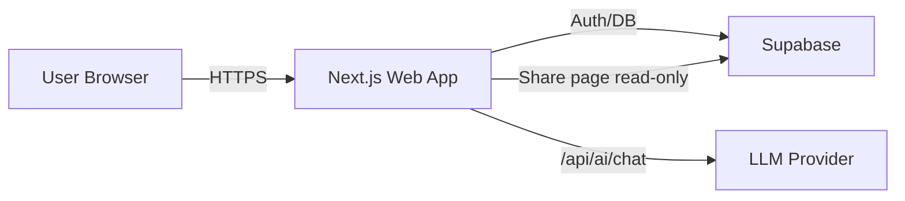

# MindMaps AI（MMA）PRD（MVP）

版本：v0.1（MVP）  
状态：Draft  
最后更新：2026-02-06

---

## 1. 背景与产品定义

**MindMaps AI（简称 MMA）** 是一个 AI 对话式思维导图工具：用户通过自然语言与 AI 协作创建、扩展与优化思维导图；同时保留传统思维导图的可视化编辑与组织能力（节点增删改移、折叠、缩放、导出、分享）。

核心价值：把“想法表达”从鼠标操作转为“对话”，并通过**可审计、可回滚的结构化改图协议（ops）**把 AI 的输出稳定落到导图结构上，实现人机协作的连续迭代。

---

## 2. 目标与成功标准

### 2.1 MVP 目标

- 用户可以登录并在云端保存/继续编辑导图
- 通过**全局对话**从零生成或扩展导图
- 通过**节点对话**围绕某个节点深挖并更新该节点子树
- AI 修改导图必须以**结构化 ops**返回并在客户端应用（而非整棵树覆盖）
- 支持**公开分享（只读）**与 **PNG/SVG 导出**

### 2.2 可验收成功标准（完成即算 MVP 达标）

1. 登录 → 新建导图 → 手工编辑 → 刷新/重新打开仍能恢复
2. 全局对话输入一句话 → AI 返回 ops → 导图结构更新且可撤销/重做
3. 选中节点进入节点对话 → AI 返回 ops → 仅影响该节点子树（scope 受控）
4. 一键生成分享链接 → 他人打开只读页面可查看
5. 导出 PNG 与 SVG 成功（文件非空、可在常用工具打开）

---

## 3. 目标用户与典型场景

### 3.1 目标用户

- 学生/自学者：学习计划、知识体系梳理、复盘
- 产品/运营/管理者：需求拆解、会议纪要、项目规划
- 研究/写作人群：资料整理、论文/文章大纲

### 3.2 典型场景

- “给我一个 X 主题的思维导图骨架” → 生成初版 → 手工微调
- “围绕这个节点继续展开 5 个角度” → 节点对话深挖并补充
- 会议中口述要点 → AI 结构化成导图 → 会议后继续完善 → 导出汇报

---

## 4. 范围与非目标

### 4.1 MVP 范围（In scope）

- Web 应用（浏览器）
- 登录 + 云端存储（Supabase）
- 单人编辑（无多人实时协作）
- 两种对话：全局对话 + 节点对话
- 经典左右树状布局（中心主题，左右分支）
- 分享只读链接
- PNG/SVG 导出

### 4.2 非目标（Out of scope）

- 多人实时协作（presence、冲突合并、权限复杂模型）
- 自由画布（任意拖拽坐标持久化、对齐线、吸附等白板能力）
- 高级样式（主题皮肤、图标库、富文本节点、附件/文件嵌入）
- 大规模知识库/检索增强（RAG/向量库）——后续迭代再做

---

## 5. 核心交互规格

### 5.1 画布编辑（非 AI）

- 节点操作：新增子节点/同级节点、重命名、删除（含子树）、移动（换父节点 + 调整顺序）
- 交互：选中/多选（MVP 可先单选）、折叠/展开子树、缩放/居中
- 撤销/重做：手工操作与 AI ops 统一进入同一历史栈
- 自动保存：编辑后 debounce 保存；离开页面前 flush

### 5.2 全局对话（AI 生成/扩展）

入口：编辑器左侧（或下方）聊天面板「全局」tab。

要求：

- 用户输入自然语言（目标/想法/限制/偏好）
- 系统携带当前导图的**摘要上下文**（标题、节点结构摘要、约束）发送给模型
- 模型必须返回：
  - `assistant_message`：给用户看的自然语言回复（解释做了什么、需要澄清的问题等）
  - `operations[]`：结构化改图操作（见第 8 节）
- 客户端/服务端必须对 ops 做 schema 校验；校验失败不得改图

### 5.3 节点对话（围绕某个节点深挖）

入口：选中节点后切换聊天面板「节点」tab（显示当前节点标题与路径）。

要求：

- 系统上下文必须包含：选中节点 `nodeId`、节点路径、该节点子树摘要、允许修改范围（scope）
- MVP 的 scope 规则：**只允许修改该节点子树**，以及在该节点下新增节点；禁止修改导图其他区域
- 若模型输出涉及 scope 外节点，必须拒绝应用并提示用户

### 5.4 分享与导出

分享（只读）：

- 用户点击「分享」生成 `public_slug`（可再次生成以失效旧链接）
- 公开页面只读渲染导图（不显示编辑能力、不显示聊天内容）

导出：

- 支持导出 **PNG** 与 **SVG**
- 导出内容为当前画布渲染结果（含折叠状态）

---

## 6. 信息架构与页面

### 6.1 页面清单（MVP）

- 登录/注册页：邮箱 + 密码（或 magic link，后续再加）
- 导图列表页：新建、打开、删除、搜索（MVP 可先不做搜索）
- 导图编辑器页（核心）：
  - 画布（导图渲染/交互）
  - 节点检查器（标题/备注编辑）
  - 聊天面板（全局/节点）
  - 工具栏（撤销/重做、保存状态、分享、导出、缩放/居中）
- 公开只读页：通过 `public_slug` 访问

### 6.2 MVP 不做但预留的入口

- 从公开页「复制到我的导图」（后续）
- 团队空间/协作（后续）

---

## 7. 技术方案（架构与选型）

### 7.1 总体架构

说明：

- 前端与 API route handlers 同在 Next.js 项目内（单仓库）
- 数据存储与权限使用 Supabase（Postgres + RLS）
- AI 通过 Provider 抽象接入（OpenAI-compatible 优先）

### 7.2 前端选型（MVP）

- Next.js（App Router）+ React + TypeScript
- UI：Tailwind CSS
- 画布：`@xyflow/react`（React Flow）负责渲染与交互
- 布局：基于树结构做“经典左右树状”布局（`d3-hierarchy` 或自研简单算法）
- 状态管理：Zustand（导图状态 + UI 状态 + undo/redo）
- Schema 校验：Zod（AI ops、API 入参）

### 7.3 后端/数据选型（MVP）

- Supabase Auth：用户登录与会话
- Supabase Postgres：导图与节点表
- RLS：保证仅 owner 可读写；公共导图匿名只读
- Next.js route handlers：封装 AI 调用与数据处理（避免把 key 暴露到客户端）

---

## 8. AI 结构化改图协议（ops）

### 8.1 设计原则

- **可控**：模型不能直接“覆盖整棵树”，只能给出 ops
- **可审计**：每次 AI 输出 ops 都记录到聊天消息中
- **可回滚**：ops 应用后进入 undo/redo 历史栈
- **可拒绝**：不符合 schema、scope 或安全约束的 ops 必须拒绝

### 8.2 ops 类型（MVP 必须支持）

> 约定：ID 使用 UUID（客户端生成），ops 中引用的节点必须存在或由同一批 ops 新建。

- `add_node`
  - `nodeId`：新节点 id
  - `parentId`：父节点 id
  - `text`：节点标题
  - `index?`：插入位置（缺省追加）
- `rename_node`
  - `nodeId`
  - `text`
- `update_notes`
  - `nodeId`
  - `notes`（markdown）
- `move_node`
  - `nodeId`
  - `newParentId`
  - `index?`
- `delete_node`
  - `nodeId`（删除整棵子树）
- `reorder_children`
  - `parentId`
  - `orderedChildIds[]`

### 8.3 强约束（必须校验）

- 禁止产生环：`move_node` 不能把节点移动到自己的子孙下
- scope 控制：节点对话只允许影响选中节点子树（以及在其下新增）
- `reorder_children` 必须覆盖该父节点当前所有 child（不允许丢失）
- 删除 root 规则：MVP 禁止删除 root；若要替换 root，只能通过“新建导图”或后续功能

### 8.4 提示词/输出格式（MVP 要求）

系统提示（摘要）：

- 输出必须包含：`assistant_message` 与 `operations`
- `operations` 必须是 JSON 数组，符合 schema；不确定时先提问（不输出 ops）

---

## 9. 数据模型（Supabase / Postgres）

### 9.1 表结构（MVP）

#### `mindmaps`

- `id uuid pk`
- `owner_id uuid`（auth.users）
- `title text`
- `root_node_id uuid`
- `is_public boolean default false`
- `public_slug text unique null`
- `created_at timestamptz`
- `updated_at timestamptz`

#### `mindmap_nodes`

- `id uuid pk`
- `mindmap_id uuid fk`
- `parent_id uuid null`
- `text text`
- `notes text null`
- `order_index int`
- `created_at timestamptz`
- `updated_at timestamptz`

#### `chat_threads`

- `id uuid pk`
- `mindmap_id uuid fk`
- `scope text`：`global` | `node`
- `node_id uuid null`
- `created_at timestamptz`

#### `chat_messages`

- `id uuid pk`
- `thread_id uuid fk`
- `role text`：`user` | `assistant` | `system`
- `content text`
- `operations jsonb null`（assistant 时存 ops）
- `provider text`、`model text`
- `created_at timestamptz`

### 9.2 RLS（必须）

- 私有数据：仅 owner 可读写
- 公共导图：匿名只读（仅 mindmaps.is_public=true 且通过 public_slug 查询）
- 聊天数据：仅 owner 可读写；公开页不返回聊天

---

## 10. API（Next.js Route Handlers）

### 10.1 `POST /api/ai/chat`

用途：对话 → 返回 `assistant_message` + `operations[]`

入参（示意）：

- `mindmapId: string`
- `scope: "global" | "node"`
- `selectedNodeId?: string`
- `userMessage: string`

出参：

- `assistantMessage: string`
- `operations: Operation[]`

服务端职责：

- 读取导图与（必要的）子树摘要，构造上下文
- 调用 Provider
- 对返回 ops 做 schema 校验；不通过则返回错误并不改图

### 10.2 保存与分享（MVP 最小接口）

- `POST /api/mindmaps`：新建导图（创建 root）
- `GET /api/mindmaps/:id`：加载导图（含 nodes）
- `POST /api/mindmaps/:id/save`：保存导图节点（MVP 可采用全量 nodes upsert）
- `POST /api/mindmaps/:id/share`：生成/刷新 `public_slug`，并设置 `is_public`
- `GET /api/public/:slug`：公开只读加载（mindmap + nodes）

---

## 11. 安全、隐私与合规（MVP 最小要求）

- 不在客户端暴露 LLM API Key
- 不把用户聊天/导图数据用于训练（在隐私政策/后续页面明确）
- 公共分享默认只读；可随时刷新 slug 让旧链接失效
- 记录 AI provider/model 便于审计与成本分析

---

## 12. 仓库与工程化（Git / GitHub / CI）

### 12.1 Git 约定

- 分支策略：trunk-based（`main`）+ PR 合并
- 分支命名：`feat/*`、`fix/*`、`chore/*`、`docs/*`
- 提交规范：Conventional Commits（commitlint 校验）

### 12.2 GitHub 配置

- PR 模板、Issue 模板
- GitHub Actions：基础 CI（lint/typecheck/unit）
- Dependabot：依赖更新
- 分支保护：`main` 必须通过 PR + CI；禁止 force push；至少 1 个 review

具体 `gh` 命令与脚本见：`docs/github-cli.md`

---

## 13. 测试计划与验收用例

单元测试（Vitest）：

- `applyOperations()`：add/rename/move/delete/reorder 的正确性与约束
- schema 校验：非法 ops 拒绝

E2E（Playwright，后续开启）：

- 登录 → 新建导图 → 编辑 → 刷新仍在
- 全局对话改图成功
- 节点对话 scope 生效
- 分享只读页可打开
- 导出 PNG/SVG 成功

---

## 14. 里程碑（建议顺序）

1. 仓库骨架（本 PRD + Git/GitHub/CI）
2. Next.js App 初始化 + 画布最小可编辑
3. Supabase：Auth + 数据表 + RLS + 保存/加载
4. 分享只读页
5. AI Provider + `/api/ai/chat` + ops 协议落地
6. 节点对话
7. PNG/SVG 导出
8. 补齐测试与体验优化
